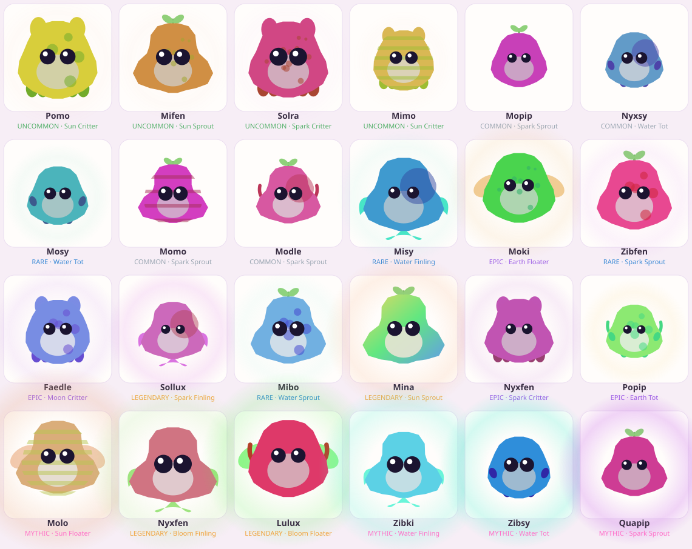

# 🌱 LUMORA

> Un monde cozy et social où l'on fait **refleurir un monde éteint** en élevant des
> créatures-compagnons **génératives** — les *Lumi* — qui naissent des jardins qu'on
> cultive, dans un monde partagé qui évolue avec toute la communauté.

**Pitch en une phrase :** *« Cultivez un jardin céleste, faites éclore des créatures
uniques que personne d'autre ne possède, et restaurez ensemble la lumière du monde. »*

Ce dépôt contient **à la fois** le dossier de production complet (game design, stratégie,
art, monétisation, business plan…) **et** une *vertical slice* réellement exécutable :
un cœur de jeu déterministe testé, une API HTTP sans dépendance, et un prototype web
jouable qui dessine chaque créature à partir de son génome.

---

## 🚀 Démarrer en 30 secondes

```bash
npm start          # API + prototype sur http://localhost:8787
npm test           # 30 tests du cœur de jeu (déterminisme, économie, progression, jardin)
npm run seed:demo  # affiche un échantillon de créatures générées
```

Aucune dépendance d'exécution n'est requise (Node ≥ 20, modules natifs uniquement).
Ouvrez ensuite `http://localhost:8787` et essayez l'onglet **✨ Generator**.

## 🗂️ Structure du dépôt

| Dossier | Contenu |
|---|---|
| [`docs/`](docs/) | **Le dossier de production** — 15 documents (vision → business plan) + GDD + PRD |
| [`core/`](core/) | Le **cœur de jeu** pur et déterministe (zéro dépendance, partagé serveur ⇄ navigateur) |
| [`server/`](server/) | API HTTP (module `http` natif) + store en mémoire (interface ⇒ Postgres) |
| [`web/`](web/) | Prototype jouable (canvas) + **moteur de rendu procédural** des Lumi |
| [`db/`](db/schema.sql) | Schéma PostgreSQL de production (validé) |
| [`tools/`](tools/) | Export SVG headless (preuve visuelle / planches de concept) |
| [`test/`](test/) | Suite de tests (`node --test`) |

## 🧬 La pièce maîtresse : le système génératif des Lumi

Chaque Lumi est dérivé **de façon déterministe** d'une graine 32 bits + le contexte du
jardin (biome, saison, soin, *bloom* mondial). Conséquences directes :

- **Variété quasi-infinie** → profondeur de collection → rétention long terme.
- **Déterminisme** → serveur autoritaire, *seed codes* partageables, anti-triche, **testable**.
- **Reproduction/combinaison** (`breedLumi`) → économie d'échange entre joueurs + viralité.
- **Render spec** (données pures) → n'importe quel client dessine la créature, **zéro asset**.
- **Stockage ~16 octets / créature** (graine + contexte) au lieu de centaines.



*24 créatures générées (4 par rareté), produites par `node tools/render-svg.js`.*

## 📐 Architecture (vue d'ensemble)

```
  Navigateur / Client            Serveur (autoritaire)         Durabilité
  ┌───────────────────┐          ┌────────────────────┐        ┌──────────────┐
  │ web/ (prototype)  │  HTTP    │ server/api.js      │        │ Postgres     │
  │  import /core ◄───┼──────────┤  └─ orchestration  │◄──────►│ (db/schema)  │
  │  lumi-render.js   │  JSON    │ core/ (règles)     │        │ Redis (chaud)│
  └───────────────────┘          └────────────────────┘        └──────────────┘
        MÊME module core/genome.js des deux côtés (une seule source de vérité)
```

Détails : [`docs/11-TECH-ARCHITECTURE.md`](docs/11-TECH-ARCHITECTURE.md).

## ✅ État de la vertical slice

- [x] Génération + reproduction déterministes des Lumi (`core/genome.js`) — **testé**
- [x] Économie 2-monnaies avec grand-livre source/puits anti-inflation — **testé**
- [x] Progression : niveaux, *streaks* quotidiens (avec jour de grâce), quêtes — **testé**
- [x] Boucle de jardin : planter → arroser → récolter → éclore — **testé**
- [x] API HTTP complète + onboarding + social (voisins, classement) — **vérifié**
- [x] Prototype web jouable + rendu procédural — **vérifié**
- [x] Schéma PostgreSQL — **validé** (appliqué sur un vrai moteur)
- [ ] Auth réelle, persistance Postgres, temps réel, client moteur (Godot) — *roadmap*

## 📜 Licence

Voir [`LICENSE`](LICENSE) — prototype propriétaire, évaluation interne.
