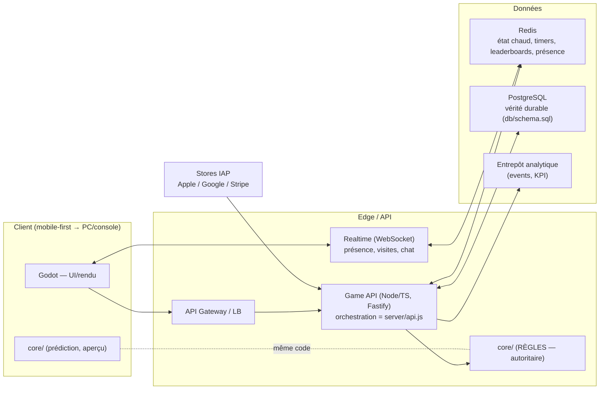

# 11 — Architecture technique

> Principe directeur : **serveur autoritaire + cœur de jeu déterministe et partagé.** Le même
> module de règles (`core/`) tourne sur le client (prédiction/aperçu instantané) et le serveur
> (vérité, anti-triche). C'est rendu possible par la conception déterministe des Lumi.

## Vue d'ensemble

## Stack recommandée (et pourquoi)

| Couche | Choix | Alternatives écartées | Raison |
|---|---|---|---|
| **Client/moteur** | **Godot 4** | Unity, natif | Coût (pas de royalties), 2.5D performant mobile, export multi-plateforme, open-source (risque fournisseur ↓). Le rendu vectoriel des Lumi y est direct. |
| **Langage cœur** | **TypeScript** (Node) | Go, C# | Le `core/` **partagé client↔serveur** exige un langage commun ; le prototype est déjà en JS/ESM portable. |
| **API** | **Fastify** (Node) | Express, Nest | Perf, schémas/validation natifs ; mappe 1:1 sur `server/api.js`. |
| **Temps réel** | **WebSocket** (µWebSockets/Colyseus) | gRPC stream | Présence, visites, chat de Constellation. |
| **BDD durable** | **PostgreSQL 15+** | MySQL, Mongo | Transactions, JSONB, intégrité (monnaie, échanges). Schéma **validé** : `db/schema.sql`. |
| **État chaud** | **Redis** | Memcached | Timers de croissance, *leaderboards* (sorted sets), présence, *rate-limit*, sessions. |
| **Analytics** | Pipeline events → **entrepôt** (BigQuery/Snowflake) | — | KPI de cohorte, A/B, économie. |
| **Infra** | **Kubernetes** + autoscale, multi-région | VM | Élasticité aux pics de lancement/événements. |
| **CDN** | Assets statiques + client | — | Latence mondiale. |

> **Migration depuis le prototype :** `server/store.js` (mémoire) implémente déjà l'**interface**
> que la version Postgres remplira ; `server/api.js` (orchestration) et `core/` (règles) restent
> **inchangés**. C'est la dette technique minimale par conception.

## Pourquoi le déterminisme change l'architecture

1. **Stockage minimal** : un Lumi = graine 32 bits + contexte (~16 octets) au lieu du génome
   complet. Le génome (incl. *render spec*) est **dérivé à la lecture** par `core/genome.js`.
   → coûts BDD/bande passante drastiquement réduits à l'échelle de millions de créatures.
2. **Anti-triche fort** : le serveur peut **rejouer** n'importe quelle génération/reproduction à
   partir des intrants stockés et **vérifier** la possession (un client ne peut pas « inventer » un
   Lumi mythic — il ne correspondrait pas à la graine+contexte autoritaires).
3. **Aperçu client instantané** : le client génère localement pour l'UI (zéro latence) ; le serveur
   confirme. Même code, donc aucune divergence.
4. **Testabilité/équilibrage hors-ligne** : on simule des millions de tirages pour régler les
   raretés et le faucet/sink **avant** le live (cf. `test/`).

## Backend — responsabilités

- **Stateless API** (horizontalement scalable) : orchestration, validation, monétisation, social.
- **État chaud Redis** : timers (`plots.ready_at`), présence, *leaderboards*, *rate limiting*.
- **Workers** : flush Redis→PG, attribution de récompenses différées, traitement d'événements,
  validation des reçus IAP, *anti-fraud* asynchrone.
- **Idempotence** : opérations sensibles (daily, achats, échanges) idempotentes (clé de requête)
  pour la robustesse réseau mobile (le daily l'est déjà : `claimDaily`).

## Scalabilité

- **Sharding** par `player_id` (UUID) ; PG en *read replicas* + *partitioning* du grand-livre et
  des events par mois.
- **Leaderboards** en Redis *sorted sets* (O(log n)) plutôt qu'en SQL trié à chaud.
- **Great Bloom** : compteur global → Redis (INCR) avec agrégation/flush, pas une ligne PG en contention.
- **Autoscale** piloté par files d'attente et latence ; *load tests* avant chaque temps fort.
- **Cible** : supporter des pics de lancement (*featuring*) avec dégradation gracieuse (mode lecture).

## Sécurité

- **Auth** : OIDC/Sign in with Apple/Google + comptes *device*; sessions par **jetons signés**
  (JWT court + refresh), rotation, révocation. (Le prototype stub l'auth par id en chemin.)
- **Transport** : TLS partout ; *certificate pinning* côté client.
- **Validation** : tout intrant validé côté serveur (le prototype valide déjà handle, items, fonds).
- **Secrets** : *secret manager* (jamais en repo) ; le `.gitignore` exclut `.env`.
- **IAP** : **validation serveur** des reçus (Apple/Google/Stripe) + **déduplication** par
  `transaction_id` (table `iap_receipts`) → jamais de double *grant*, anti-rejeu.
- **Confidentialité/conformité** : RGPD + RGPD-K, COPPA (mineurs), suppression/export de compte,
  minimisation des données, consentement *tracking* (ATT). *Age-gating* dès l'inscription.
- **Modération UGC** : filtres + signalement + revue humaine (cf. 05).

## Anti-triche

- **Économie autoritaire** : monnaie/objets jamais accordés par le client ; chaque mouvement
  journalisé (`economy_ledger`) → audit et *rollback* possibles.
- **Possession vérifiable** : Lumi reconstruits depuis graine+contexte serveur (cf. déterminisme).
- **Rate-limiting & détection d'anomalies** : vitesse d'éclosion/échange, *bots*, *trust score*.
- **Anti-RMT** : surveillance des échanges (taxe, plafonds, motifs), bannissements.
- **Intégrité client** : *attestation* (Play Integrity / DeviceCheck), détection de *tampering*.
- **Snapshots & rapprochement** : jobs qui recoupent soldes vs grand-livre (détection d'exploits).

## IA (usages concrets, pragmatiques)

**Décision :** l'IA est un **outil de production et de live-ops**, pas un gadget marketing.

- **Pipeline de contenu génératif** (déjà le cœur) : extensible par IA pour proposer de nouvelles
  *familles* de formes/mutations que les artistes valident (humain dans la boucle).
- **Modération UGC assistée** (texte/image) : pré-filtrage, priorisation de la revue humaine.
- **Live-ops/équilibrage** : modèles de propension (churn, conversion) pour cibler récompenses et
  réactivations ; détection d'anomalies économiques/fraude.
- **Support joueur** : assistant FAQ/ticketing.
- **Garde-fous** : pas d'IA générative non modérée exposée aux joueurs ; supervision humaine sur
  tout ce qui touche au contenu public et aux décisions sensibles.

## Observabilité & qualité

- **Logs structurés**, métriques (latence, erreurs, *crash-free*), traçage distribué.
- **CI/CD** : la suite `test/` (cœur de jeu) en *gate* obligatoire ; validation du schéma SQL en CI
  (PGlite/Postgres scratch — déjà prouvé faisable dans ce dépôt) ; *canary releases*.
- **DR/Backups** : sauvegardes PG *point-in-time*, *runbooks* live-ops, plan de bascule région.

## Persistance : `MemoryStore` ⇄ `PgStore` (implémenté)

Deux implémentations partagent **la même interface** ; l'API (`server/api.js`) est identique
pour les deux (`server/store.js` choisi par défaut, `server/pgStore.js` si `DATABASE_URL`).

- **Unité de travail par requête** (`AsyncLocalStorage`) : pendant une requête, `getPlayer`/
  `createPlayer`/`getConstellation`/`getTrade` hydratent les entités dans une *identity map* ;
  les handlers mutent ces objets vivants exactement comme en mémoire ; après une requête POST
  réussie, `commit()` réécrit toutes les entités touchées dans **une transaction** (un échec de
  handler saute le commit → aucune écriture partielle). Les GET ne persistent jamais.
- **Mapping relationnel** (cf. [`db/schema.sql`](../db/schema.sql)) : players + wallets +
  daily_streaks + gardens + lumi + economy_ledger + constellations(+members) + trades +
  world_state. Le détail de progression par joueur (pity, pass, unlocks, stats, bloomdex,
  guilde) vit dans `players.flags` JSONB ; le génome résolu est persisté (les Lumi *issus de
  reproduction* ne sont pas reproductibles depuis la seule graine).
- **Adaptateur DB unique** (`server/db.js`) : `query`/`exec`/`tx`/`close` au-dessus de **PGlite**
  (tests/CI, Postgres WASM embarqué) **ou** `pg.Pool` (production, dépendance optionnelle).
- **Durabilité prouvée** : `test/pgstore.test.js` rejoue les flux de bout en bout contre un vrai
  moteur Postgres et vérifie que l'état survit à **une instance de store toute neuve** sur la même base.

## Dette technique connue du prototype (assumée)

- ~~Store en mémoire (pas de durabilité)~~ → **fait** : `PgStore` relationnel + test de durabilité.
- Auth stub (id en chemin) → à remplacer par des jetons signés.
- `commit` réécrit la collection d'un joueur par DELETE+INSERT (simple et correct ; à rendre
  incrémental pour de très grandes collections en production).
- Compteur mondial (Great Bloom) en mémoire de processus → à déplacer vers Redis (INCR) à l'échelle.
- Pas de temps réel/WebSocket (le social est REST) → ajouté en bêta.
- Génome v1 (`schema:1`) versionné → migrations gérées par le champ `schema`.
